# Luanalysis (an EmmyLua fork) for IntelliJ IDEA

An IDE for statically typed Lua development.

_Derived from [EmmyLua](https://emmylua.github.io/)._


## Find usages


## Rename


## Parameter hints


## Go to symbol


## Go to class


## Quick Documentation(Ctrl + Q)


## Method separators


## Method override line marker


## Installation

The latest release is available for download within IntelliJ or from the [Jetbrains Plugin website](https://plugins.jetbrains.com/plugin/14698-luanalysis).

## Features

Luanalysis is derived from EmmyLua and supports all the basic editing and refactoring functionality provided by [EmmyLua](https://github.com/EmmyLua/IntelliJ-EmmyLua).

Beyond basic Lua editing capabilities, Luanalysis supports a significant amount of additional functionality necessary to statically type advanced codebases.

_**Note**: Features are roughly listed in the order they were implemented, by no means order of importance._

#### Demo Project

A great way to see what's possible in terms of static typing is to checkout the [Luanalysis demo project](https://github.com/Benjamin-Dobell/LuanalysisTypesDemo/).

### EmmyDoc Block Comments

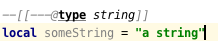

### Type casts

In addition to defining new types, the `@type` tag can now we also used to cast the result of a Lua expression.

This is most useful with the newly added support for EmmyDoc block comments as we can easily specify inline type casts:

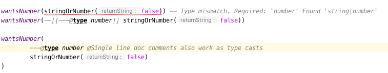

https://github.com/Benjamin-Dobell/LuanalysisTypesDemo/blob/cfea19c9fd744078f50f61e74e620b7505b58c65/src/type_casts.lua

### Improved variance detection

EmmyLua attempts to determine if a type is assignable to another type simply by checking if the former is a "subtype" of latter, however proper type variance of complex types is not implemented. For example, functions may be covariant or contravariant of other function types, depending on parameters and return value types:

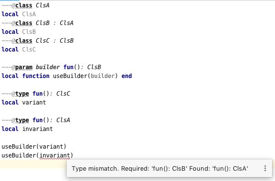

EmmyLua does _not_ report the above error.

Additionally, union variance detection has been fixed:

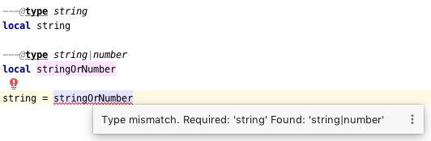

As above, the current release of EmmyLua does not catch this error.

### Primitive literal types

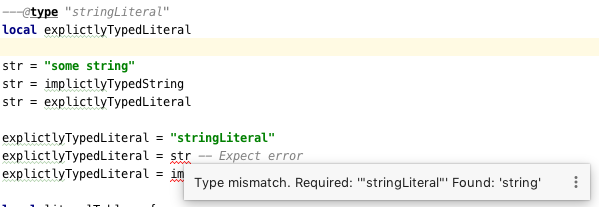

https://github.com/Benjamin-Dobell/LuanalysisTypesDemo/blob/cfea19c9fd744078f50f61e74e620b7505b58c65/src/string_literals.lua

### Generic parameter type usage within function bodies


https://github.com/Benjamin-Dobell/LuanalysisTypesDemo/blob/cfea19c9fd744078f50f61e74e620b7505b58c65/src/function_generics_scope.lua

### Binding of EmmyDoc to lambdas in assignments

i.e. Type checking now works inside function "lambdas" assigned to a variable with an EmmyDoc definition.

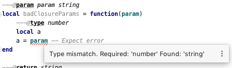

https://github.com/Benjamin-Dobell/LuanalysisTypesDemo/blob/cfea19c9fd744078f50f61e74e620b7505b58c65/src/lambda_params.lua

### Table type checking improvements

Various improvements, for example EmmyDoc "arrays" are now assignable to compatible table types e.g.


The current EmmyLua release will report an error here even though this is sound.

https://github.com/Benjamin-Dobell/LuanalysisTypesDemo/blob/cfea19c9fd744078f50f61e74e620b7505b58c65/src/tables.lua

### Generic classes (!!!)

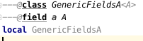

https://github.com/Benjamin-Dobell/LuanalysisTypesDemo/blob/cfea19c9fd744078f50f61e74e620b7505b58c65/src/generic_class_fields.lua

### Support for generic params referencing generic params

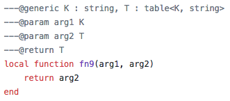

https://github.com/Benjamin-Dobell/LuanalysisTypesDemo/blob/cfea19c9fd744078f50f61e74e620b7505b58c65/src/function_generics.lua#L226-L249

### Generic inference fixes

The current EmmyLua release is unable to infer generics correctly in several situations and thus reports type errors where no error exists, and also misses errors where errors should exist e.g.

https://github.com/Benjamin-Dobell/LuanalysisTypesDemo/blob/cfea19c9fd744078f50f61e74e620b7505b58c65/src/function_generics.lua#L154-L181

### Type errors are now errors by default

By default, type safety errors are now reported as errors instead of warnings. This is made feasible by three things:

1. Many improvements in the ability to specify complex types
2. Type safety bug fixes
3. _Casting_

Casting in particular means that if a user is doing something the type system deems unsafe, but they know at runtime will be fine, they can just add a cast to signify this and the error will go away. 

### Generic parameter use _within a class_

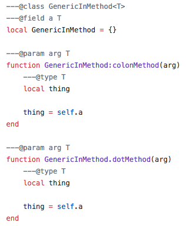

Shadowing of a generic parameter is forbidden and an error reports:

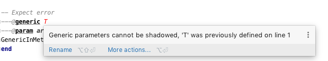

https://github.com/Benjamin-Dobell/LuanalysisTypesDemo/blob/cfea19c9fd744078f50f61e74e620b7505b58c65/src/generic_class_scope.lua

### "No such member" inspection

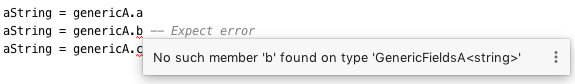

https://github.com/Benjamin-Dobell/LuanalysisTypesDemo/blob/cfea19c9fd744078f50f61e74e620b7505b58c65/src/generic_class_fields.lua#L44-L45

### `self` is a real type

Improved type checking for `self`, for example `self` can be assigned to a variable that matches the parent type of a method. However, that parent type cannot be assigned to `self`, as the class may be sub-classed (in which case `self` refers to a more specific type).

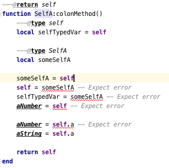

https://github.com/Benjamin-Dobell/LuanalysisTypesDemo/blob/cfea19c9fd744078f50f61e74e620b7505b58c65/src/self.lua

### Type checking of immediately assigned variable declarations


Current EmmyLua release will allow this invalid assignment.

### Fixed a bug where the type inference cache was being used in the presence of an index

When a function returns multiple values, the current EmmyLua release will infer values and put them in the cache. This is inaccurate as generic types analysis may result in the same generic parameter being resolved differently based on the value being assigned, thus the cache cannot be used in this circumstance. Presently this results in both missing errors, and additional inaccurate errors, depending on the assignment.

### Added support for `@shape` (!!!)

A shape can be defined similarly to a class, except that contravariance is determined by compatibility of the members _not_ the inheritance hierarchy.

This is most useful when working with "structures" (e.g. JSON) rather than OOP classes.

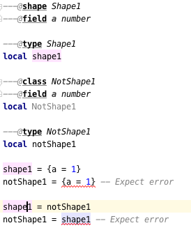

https://github.com/Benjamin-Dobell/LuanalysisTypesDemo/blob/cfea19c9fd744078f50f61e74e620b7505b58c65/src/shape.lua

What makes shapes particularly useful is that they support generics and inheritance (at definition time, not assignment) just like classes:

https://github.com/Benjamin-Dobell/LuanalysisTypesDemo/blob/cfea19c9fd744078f50f61e74e620b7505b58c65/src/shape.lua#L36-L74

Even _better_, type inspections are not just reported on incompatible `table`s as whole, but rather the inspections know how to traverse _table literals_ and provide detailed annotations of incompatibilities between two shapes e.g.


### Generic Aliases (!!!)

Aliases can now take generic parameters, just like a class or shape.

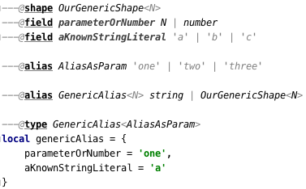

https://github.com/Benjamin-Dobell/LuanalysisTypesDemo/blob/cfea19c9fd744078f50f61e74e620b7505b58c65/src/generic_alias.lua

### Improved vararg syntax

Function types can now use `...: T` as an alternative to `vararg T`:


### Variadic return values (!!!)

We now support variadic return values:

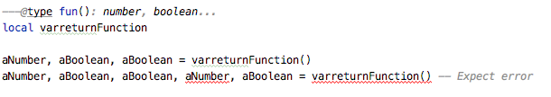

Internally, `TyTuple` has been replaced with `TyMultipleResults` to reflect the fact that this construct is not fixed size. Additionally, multiple results are now properly handled in more locations.

### Standard library type improvements

Various improvements to typings of Lua built-ins taking advantage of variadic return values etc.

### Support for indexed fields (!!!)

We can now type all properties of tables, not just string constants. Given that Luanalysis also adds support for primitive literal types we can use this a lot of different ways e.g.


Here we have regular string identifier fields, number literal fields `[1]`, `[2]` and `[3]` _and_ a `[boolean]` field. That last one is really powerful, because it's _not_ a constant, it's a real type.

We can type custom data structures e.g.

```lua
---@class Dictionary<K, V>
---@field [K] V
```

This will work correctly for any `K` and everything will be statically type checked as you'd expect.

There's also syntax for table types, it works for table literals _and_ anonymous classes (i.e. tables that aren't explicitly typed):

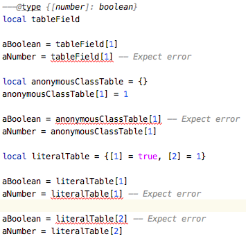

### Partially typed functions

We now support `fun` types with optional parameter lists and optional return values i.e. `fun: boolean` and `fun(arg: boolean)`. `fun` (with neither specified) also works for posterity but is functionally equivalent to the existing `function` type.

Partially typed functions are extremely useful for implementing callback and handler patterns. For example, it's quite common to have an extensible event system where each event has unique arguments, but the handler must return `true` to indicate the event was handled:

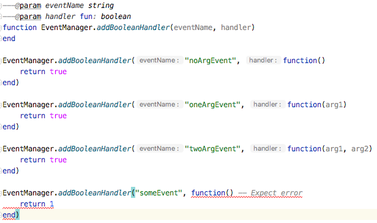

### Callable types (!!!)

This is another _really_ useful feature. We can now properly indicate that an object is callable (i.e. is a `table` whose metatable has a `__call` method).


This is done by using the existing `@overload` EmmyDoc keyword, and works similarly i.e. we can specify many overloads and type checking and completion will work as you'd expect:

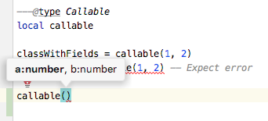

### Strongly typed tuples

Tuples


## Building from Source

  `./gradlew build_201`

For more details about the Jetbrains Platform SDK please refer to the [official documentation](https://www.jetbrains.org/intellij/sdk/docs/basics/getting_started/setting_up_environment.html).

### Installation from Source

To install the `.zip` you built, you'll need to go to IntelliJ's...

    Preferences -> Plugins -> Settings Cog Icon -> Install Plugin from Disk...


Select the `.zip`, and then when prompted, restart IntelliJ.

## Developed By

Luanalysis by:
[Benjamin Dobell](https://github.com/Benjamin-Dobell)

EmmyLua by:
[**@tangzx** 阿唐](https://github.com/tangzx)

**Contributors**

Please [refer to Github](https://github.com/Benjamin-Dobell/IntelliJ-Luanalysis/graphs/contributors) for a complete list of contributors.
